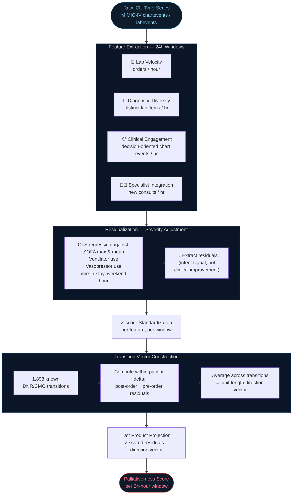
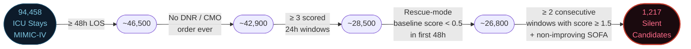
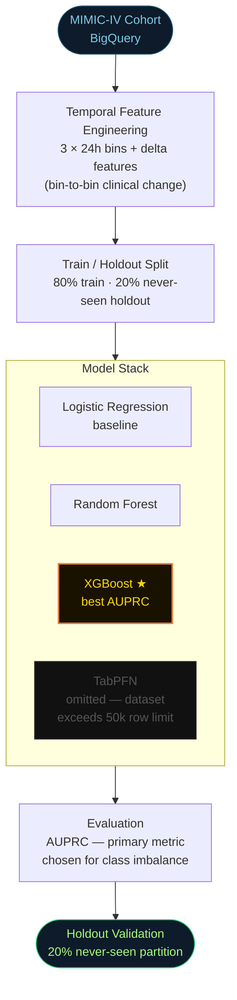
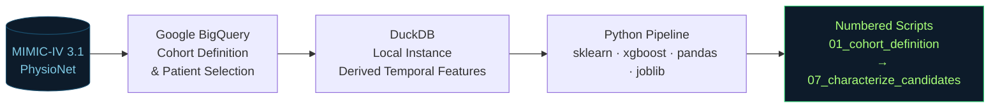

<div align="center">

<br/>

```
╔══════════════════════════════════════════════════════════════════╗
║                                                                  ║
║   SILENT  DE-ESCALATION  IN  THE  ICU                           ║
║   Detecting the Behavioral Gap Between                           ║
║   Clinical Action and Formal Documentation                       ║
║                                                                  ║
╚══════════════════════════════════════════════════════════════════╝
```

[](https://physionet.org/content/mimiciv/)
[](https://python.org)
[](https://xgboost.readthedocs.io/)
[](https://duckdb.org)
[](https://cloud.google.com/bigquery)
[]()
[]()

<br/>

*MIMIC-IV Datathon Analysis — April 2026*

</div>

---

## The Question

In the intensive care unit, a patient's code status is supposed to be written in the chart. Clinicians sometimes notice that the team has quietly moved on from a patient — ordering fewer labs, writing shorter notes, calling fewer specialists — well before that conversation happens on paper. This project asks whether that gap between what the team does and what the chart says is measurable, and who it happens to.

When the care team's internal picture of a patient diverges from documented goals, families may still believe the team pursues recovery when the team has already shifted toward comfort. Quality reviews and fairness audits, which operate from the chart, miss these patients entirely. The patient drifts into a softer kind of care without the conversation that would let them choose it.

---

## The 48-Hour Silent Gap


Care teams begin de-escalating roughly **48 hours** before the chart reflects any change. The diagram above maps the divergence between measured care intensity and the palliative-ness score across three phases: rescue mode, the undocumented transition window, and formal comfort care. Approximately 42% of the total behavioral shift completes before any order exists on paper.

---

## The Palliative-ness Score

The score quantifies care intensity through four proxies computed over every 24-hour window of every stay.



Each feature is residualized against severity covariates — SOFA scores, ventilation status, vasopressor use, time into stay, weekend indicator, hour of day, and window duration — using ordinary least squares. This ensures the score tracks clinical intent, not patient improvement. A transition vector is defined by the mean within-patient delta across 1,898 documented DNR/CMO transitions, normalized to unit length. The final score is the dot product of a window's z-scored residuals against this vector.

| Feature | What it captures | High value (rescue mode) | Low value (palliative signal) |
|:---|:---|:---:|:---:|
| **Lab Velocity** | Orders per hour — how actively the team investigates | Broad, frequent ordering | Minimal or repeated-only labs |
| **Diagnostic Diversity** | Distinct lab item types per hour — breadth of the workup | Wide panel across organ systems | Same few tubes, narrowing scope |
| **Clinical Engagement** | Decision-oriented chart events per hour, excluding routine vitals, alarms, and respiratory entries | Active notes, reassessments, plan updates | Short or templated entries only |
| **Specialist Integration** | New subspecialty consultations per hour | Multiple services actively involved | No new consults being placed |

These four features also inform why long ICU stays (≥ 21 days) serve as the predictive target for the modeling pipeline. Patients who stay that long tend to be exactly those for whom all four signals drop in a sustained way while severity does not improve — the behavioral signature of a team that has quietly shifted, whether documented or not. Identifying this sub-population prospectively is what the downstream XGBoost model attempts.

---

## Silent Candidate Detection

The filter that identifies patients whose behavior matches the palliative signature without any formal order applies five criteria sequentially.



The sharp attrition at the persistence criterion — from 26,800 to 1,700 before the severity constraint — demonstrates that the filter is selective. Among patients who did eventually transition to CMO, 6.4% meet the same criteria, a 2.2-fold enrichment over the 2.8% base rate in the never-transition population. The enrichment validates that the filter captures a real behavioral pattern.

---

## Key Findings

**1,217 silent candidates** identified — 2.8% of the never-transition population — whose care patterns match the palliative signature without any chart update.

The behavioral shift precedes formal documentation by approximately **48 hours** in CMO transitions, with **42%** of the total de-escalation occurring before the order is written. CMO transitions show a sharper trajectory than DNR-only transitions, consistent with the clinical distinction: CMO represents a complete commitment to comfort care, while DNR limits one specific intervention.

Silent candidates are older, sicker, and stay longer. They are 2.6× more likely to have an ICU stay of three weeks or more, 1.8× more likely to be multimorbid, 1.4× more likely to be 75 or older, and 1.3× more likely to be repeat ICU users. On outcomes: 2.8× more likely to die in hospital, 1.8× more likely to discharge to hospice, and 2.5× less likely to go home. Gender, Black, Hispanic, and Asian ethnicity, and marital status each failed to reach significance after FDR correction.

---

## Predictive Modeling — Long ICU Stay (≥ 21 Days)

To identify the sub-population most at risk, the pipeline targets ICU stays of 21 days or longer using temporal bin features and gradient-boosted trees.



### Model Performance

<table>
<thead>
<tr>
<th align="left">Model</th>
<th align="center">Val AUPRC</th>
<th align="center">Val AUROC</th>
<th align="center">Val Sensitivity</th>
<th align="center">Holdout AUPRC</th>
<th align="center">Holdout AUROC</th>
<th align="center">Holdout Sensitivity</th>
<th align="left">Notes</th>
</tr>
</thead>
<tbody>
<tr>
<td><strong>🏆 XGBoost</strong></td>
<td align="center"><strong>0.592</strong></td>
<td align="center"><strong>0.958</strong></td>
<td align="center"><strong>0.611</strong></td>
<td align="center"><strong>0.557</strong></td>
<td align="center"><strong>0.959</strong></td>
<td align="center"><strong>0.559</strong></td>
<td><strong>Selected model</strong></td>
</tr>
<tr>
<td>Random Forest</td>
<td align="center">0.470</td>
<td align="center">0.948</td>
<td align="center">0.555</td>
<td align="center">0.414</td>
<td align="center">0.948</td>
<td align="center">0.494</td>
<td>Ensemble baseline</td>
</tr>
<tr>
<td>Ridge</td>
<td align="center">0.208</td>
<td align="center">0.915</td>
<td align="center">0.000</td>
<td align="center">0.219</td>
<td align="center">0.920</td>
<td align="center">0.000</td>
<td>Predicts all-negative at 0.5 threshold</td>
</tr>
<tr>
<td>Lasso</td>
<td align="center">0.208</td>
<td align="center">0.916</td>
<td align="center">0.000</td>
<td align="center">0.218</td>
<td align="center">0.921</td>
<td align="center">0.000</td>
<td>Predicts all-negative at 0.5 threshold</td>
</tr>
<tr>
<td>TabPFN</td>
<td align="center">n/a</td>
<td align="center">n/a</td>
<td align="center">n/a</td>
<td align="center">n/a</td>
<td align="center">n/a</td>
<td align="center">n/a</td>
<td>Omitted — dataset exceeds 50k row memory limit</td>
</tr>
</tbody>
</table>

> AUPRC was selected as the primary metric given significant class imbalance in the long-stay label. Ridge and Lasso, despite strong AUROC scores, collapse to all-negative predictions at the default 0.5 threshold — a known failure mode under severe imbalance. Holdout performance was evaluated on a 20% partition withheld from all training and tuning steps.

### Top Predictive Features — XGBoost (≥ 21-Day Stay)

Features use a temporal bin suffix: `_b0` = first 24h, `_b1` = 24–48h, `_b2` = 48–72h. The `d_` prefix denotes a bin-to-bin delta.

| Rank | Feature | Description |
|:---:|:---|:---|
| 1 | `sepsis3_flag` | Sepsis-3 criteria met during stay |
| 2 | `vent_invasive_b2` | Invasive ventilation present in bin 2 (48–72h) |
| 3 | `vent_invasive_b1` | Invasive ventilation present in bin 1 (24–48h) |
| 4 | `service_NSURG` | Neurosurgery service admission |
| 5 | `num_diagnoses` | Total diagnosis count at admission |
| 6 | `d_sofa_max_b2b1` | Change in max SOFA score from bin 1 → bin 2 |
| 7 | `rrt_flag_b0` | Renal replacement therapy in first 24h |
| 8 | `service_MED` | General medicine service admission |
| 9 | `cerebrovascular_disease` | Comorbidity flag |
| 10 | `sbp_min_b2` | Minimum systolic BP in bin 2 |

Sustained mechanical ventilation across multiple bins (`b1` and `b2`) ranks as the strongest single clinical signal, consistent with the palliative-ness score finding that long-stay candidates tend to remain on ventilatory support without severity improvement. The SOFA delta feature (`d_sofa_max_b2b1`) captures whether organ dysfunction is worsening between day two and three — a trajectory signal rather than a snapshot.

---

## Data Architecture



Scripts execute sequentially from `01_cohort_definition` through `07_characterize_candidates`. present in the pallative/code folder

---

## Outcome Distribution

| Discharge Destination | Silent Candidates | Other Full-Code Patients |
|:---|:---:|:---:|
| Died in hospital | 26.9% | 11.7% |
| Discharged to hospice | 5.1% | 2.9% |
| Transferred to rehab / long-term facility | 46.6% | 44.0% |
| **Went home** | **21.2%** | **40.7%** |

---

## Limitations

This analysis produces a statistical pattern across thousands of patients, not a verdict on any individual stay or clinician. The association between silent candidacy and worse outcomes does not establish causation: patients who match the pattern arrive sicker, and baseline severity likely accounts for a portion of the outcome difference independent of any behavioral shift. The severity-non-improving constraint controls for improvement confounding, but the control is imperfect.

Inference about team intent rests on behavioral signals in the data rather than direct observation of clinical reasoning. MIMIC-IV comes from a single academic medical center in Boston, and whether the pattern generalizes to other ICU environments remains an open question. The ultimate validation — a clinician reading the notes of these 1,217 patients and judging whether the care pattern looks palliative — requires a chart review not yet performed.

---

## Forward Directions

A qualitative chart review of a random sample from the 1,217 silent candidates would establish whether clinical readers agree the pattern reflects palliative intent. Demographic breakdowns across age, ethnicity, and marital status warrant formal testing, since silent de-escalation represents exactly the kind of phenomenon where disparities would matter most. If the signal can be detected prospectively, it could serve as a prompt for formal goals-of-care conversations, giving patients and families more time and more voice. External validation against other large ICU databases would establish whether this pattern reflects one institution's culture or a wider phenomenon in critical care.

---

## Tech Stack

| Layer | Technology |
|:---|:---|
| Data Source | MIMIC-IV v3.1 (PhysioNet) |
| Cohort Engine | Google BigQuery |
| Feature Engine | DuckDB (local) |
| Language | Python 3.8 |
| ML Libraries | scikit-learn, XGBoost, pandas, joblib |
| Reproducibility | Numbered scripts `01_` → `07_` |

---

## Contributors

<div align="center">

**Mentors**

| Name | Contact |
|:---|:---|
| **Ahram Han** | [ahramh@gmail.com](mailto:ahramh@gmail.com) · [aramis00](https://github.com/aramis00) |
| **Robert J. Kahoud, M.D.** | [robertkahoud@gmail.com](mailto:robertkahoud@gmail.com) |

**Data Team**

| Name | Contact |
|:---|:---|
| **Brett Knox** | [brettknox2003@gmail.com](mailto:brettknox2003@gmail.com) · [BrettKnox](https://github.com/BrettKnox/) |
| **Yu Yin Cheong** | [yy.yuyincheong@gmail.com](mailto:yy.yuyincheong@gmail.com) · [YuYinCheong](https://github.com/YuYinCheong) |
| **Krishna K. Joshi** | [krishnakjoshi1@gmail.com](krishnakjoshi1@gmail.cpm) . [KrishnaKJoshi1](https://github.com/KrishnaKJoshi1)  
| **Ashritha Kotagiri** | [ashritharao421@gmail.com](mailto:ashritharao421@gmail.com) · [Ashritha456](https://github.com/Ashritha456) |
| **Simon McCormack** | [@simonmccormack](https://github.com/simonmccormack) |

**Medical Team**

| Name | Contact |
|:---|:---|
| **Marta E. Berguido** | [BerguidodelaGuardia.Marta@mayo.edu](mailto:BerguidodelaGuardia.Marta@mayo.edu) |
| **Elizabeth Carey** | [elizabeth.carey@unf.edu](mailto:elizabeth.carey@unf.edu) |
| **Ross Reichard** | [Reichard.Robert@mayo.edu](mailto:Reichard.Robert@mayo.edu) |

</div>

---

## Citation

If you use this work, please cite the MIMIC-IV datathon analysis and reference the PhysioNet MIMIC-IV v3.1 dataset:

```bibtex
@misc{silent_deescalation_2026,
  title   = {Detecting Silent Shifts Toward Comfort Care in the ICU},
  author  = {Han, Ahram and Knox, Brett and Cheong, Yu Yin and Joshi, Krishna K.
             and Kotagiri, Ashritha and McCormack, Simon
             and Berguido, Marta E. and Carey, Elizabeth
             and Kahoud, Robert J. and Reichard, Ross}
  year    = {2026},
  note    = {MIMIC-IV Datathon Analysis},
  url     = {https://github.com/KrishnaKJoshi1}
}
```

---

<div align="center">
<sub>Built on MIMIC-IV · PhysioNet · MIMIC-IV Datathon 2026</sub><br/>
<sub>All patient data accessed under PhysioNet credentialed access agreement.</sub>
</div>
